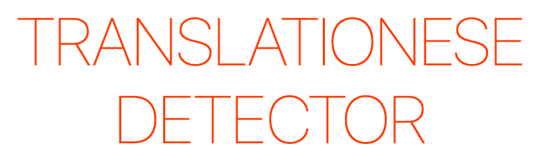

This project was created during the [Swissinfo (SWI) Multilingual Hackathon](https://swihack.ch/) in Bern, Switzerland. The theme of the hackathon was to empower linguistic diversity in newsrooms. The hackathon was held during the International Mother Language Day (Feb. 21-22, 2020).

### Description

Often media sites translate quotes and names using automated tools, and mistakes creep in. Sometimes its humans who inadvertedly make translation mistakes. This project aims to find ways to highlight such errors and offer alternative suggestions on media sites.

Key question: How to highlight translation mistakes and offer suggestions for improvement?

#### Translation mistakes that occure frequently

- Idioms - Idiom is a phrase or an expression that has a figurative, or sometimes literal, meaning.
- Quotes
- Negations
- Translations of tense
- Change of meaning and style
- "Translationese" - Awkwardness or ungrammaticality of translation, such as due to overly literal translation of idioms or syntax.
- "False Friends" - False friends are words in different languages that look or sound similar, but differ significantly in meaning (English: embarrassed -> Spanish: embarazada (which means pregnant))

### Approach

A list of sentences with a "good" and a "bad" translations was collected. Based on that dataset multiple checks where implemented. The result of these checks is visualized in an interface. The interface allows the autors to quickly identify potentially flawed translations and fix them.

#### Potential checks

- Wordcount per sentence (implemented)
- Wordcount per document
- False friend detection (implemented)
- Sentiment analysis
- Negation detection
- Idiom detection
- Readability - [FLESCH-Index](https://fleschindex.de/berechnen)

### Potential improvements

- Currently there are only a few checks implemented. The project could be extended with more checks in the future. See the list above to see what could be implemented next.
- The source dataset is very small. It should be extended with more data, which would allow to further improve the checks.
- The current solution doesn't allow to detect bad translations dynamically. It's not possible to edit the tranlations in the interface directly and see if the translation is improved.
